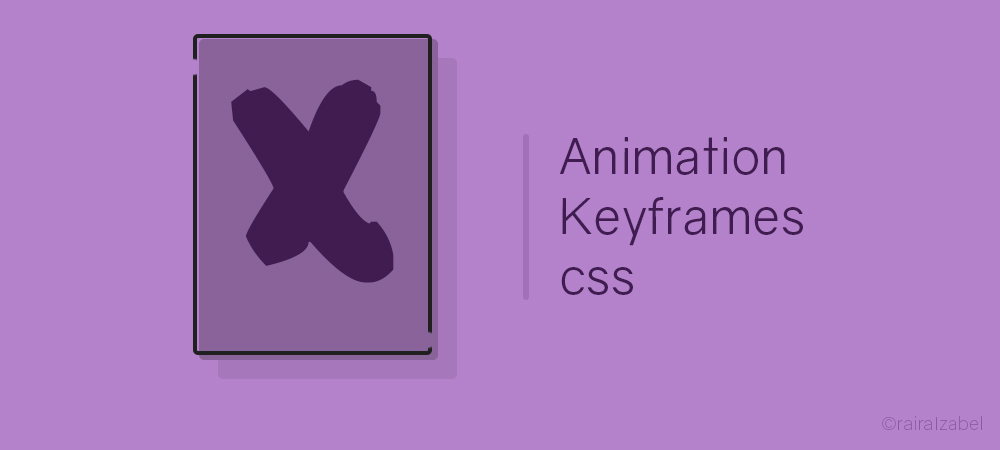

# Error animation

##### Read this in [:us:](translation/english.md) [:es:](translation/spanish.md)

Olá gente :sparkles: para quem está caindo de paraquedas aqui, esse repositório contém 4 tipos de animação em keyframes para serem colocados em páginas de error de sites, portais, aplicativos e etc. Para quem busca codar animações sem a necessidade de utilizar .js seus filhos (frameworks), esse é o lugar certo.

Antes de mais nada, para quem quiser criar novos erros baseados nos que foram ensinados aqui, tem total liberdade!!! Espero que gostem, aprendam e repassem para outras pessoas que busquem o mesmo que encontraram aqui.

### O que é keyframes
Para quem não conhece os Keyframes, eles são uma propriedade que significa o que o próprio nome diz: chaves de quadros, ou seja, ele cria uma "chave" para designar respectiva ação dentro da classe que você criou.
Eles podem acionar qualquer coisa, desde mexer um circulo da direita para esquerda infinitamente, até permitir desenhar seu personagem favorito da cartoon netwoork, só com classes sobrepostas.

Os keyframes são chamados a partir de uma propriedade chamada animation, onde você aciona o keyframe. _Exemplo:_

```
.bola{
width: 5rem;
height: 5rem;
border-radius: 360px;
background: red;
animation: rodar transition 1s infinite ease;
}
```
Rodar, é o Keyframe.

### Rodar o projeto localmente
**0 -** Instale as dependências básicas
- [Git](https://git-scm.com/)

**1 -** Clone o projeto e instale
```
$ git clone https://github.com/rairaIzabel/error-animation.git
$ cd error-animation
$ gitcheckout -b "nome-da-sua-branch"
```
_Também é possível utilizar pré-processadores de estilização para criar as animações, como:_
- [Sass](https://sass-lang.com/install)
- [Less](http://lesscss.org/)
- [Stylus](http://stylus-lang.com/)
- [Materialize](https://materializecss.com/getting-started.html)
